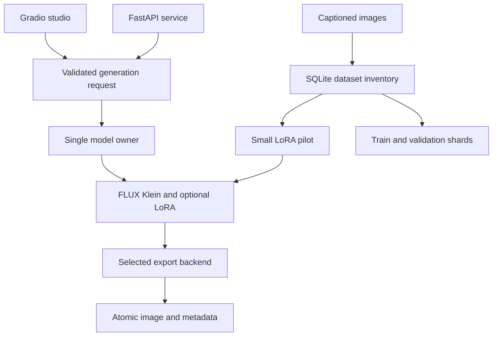

# IMG Creator

## Hosted subscription platform — version 0.6

See the [detailed image-understanding and caption review guide](docs/image-understanding.md)
for local multi-view analysis, object crops and reviewed training lineage.

See the [8K generation architecture and worker setup](docs/high-resolution-pipeline.md)
for progressive learned super-resolution, native source preservation and stage records.

See the [training-first workflow, schema and recovery guide](docs/training-lifecycle.md)
for versioned datasets, grouped splits, training controls and preserved artifacts.

The public studio adds user accounts, private galleries, model/effort/resolution
selection, credit quotes, Stripe subscription hooks, a durable job queue, an owner
console, dataset review and a separate GPU LoRA worker. Start with the
[hosted platform and Render deployment guide](docs/platform.md). The
[Render Blueprint](render.yaml) and [platform environment example](.env.platform.example)
are included. Provider keys, a private bucket, Stripe setup and GPU validation are
still required; this change does not deploy or purchase services.

**The sections below describe the original local studio**, which remains a separate
entry point. Do not expose its single-owner API as the hosted multi-user app.

A local image studio built around FLUX.2 Klein. Generate photographs, illustrations, products, architecture and other visual styles; use a reference image; apply your own LoRA; export reproducible image/metadata pairs.

**Local studio — awaiting real-model hardware validation.** No hosted image API or paid SaaS is required. Model downloads need internet initially. Hardware, electricity and rented GPUs still have costs.

## What is implemented, tested, and planned

| Capability | Status |
|---|---|
| Fast / Quality / Ultra profiles, aspect and export presets, style controls | Implemented; request and preset tests pass |
| Batch seeds, PNG/JPEG/WebP, atomic JSON/image storage | Implemented; tested with synthetic images |
| FastAPI, API key option, artifact retrieval, upscale endpoint | Implemented; HTTP roundtrip tested with a fake model |
| Gradio gallery, download controls, reference-image upload, bounded queue | Implemented; UI construction and callback smoke checks |
| Lazy FLUX Klein loading, CPU offload, model switching, VAE tiling | Implemented against pinned upstream API; real inference untested here |
| Registered LoRA loading, weights and cleanup | Implemented; failure cleanup tested with mocks; real adapters untested |
| Tiled learned SR via Spandrel, including compatible Real-ESRGAN/SwinIR weights | Implemented; tiling geometry tested; real weights untested here |
| Large dataset inventory, duplicate checks, group splits and tar export | Implemented; fixture-based integration tests pass; million-image scale unbenchmarked |
| LoRA pilot launcher using official Diffusers trainer | Implemented; command validation tested; no training run performed |
| Multi-node streaming training, semantic near-duplicate search, tiled diffusion refinement | Planned |

No generated samples, throughput claims, trained adapters or quality scores are presented as measured results. This environment has not downloaded FLUX weights or run a GPU training job.

## Quick start

Python 3.11 or 3.12, Git, sufficient disk/RAM, and preferably an NVIDIA GPU. Apple MPS and CPU are available inference paths; speed and memory requirements depend on hardware. The conservative MPS path uses float32 and can require substantial unified memory. For large-scale training, use an appropriately sized Linux/CUDA machine after a small memory test.

```bash
git clone https://github.com/amey1234444/IMG_Creator.git
cd IMG_Creator
python -m venv .venv
source .venv/bin/activate
python -m pip install --upgrade pip
pip install -e '.[inference,ui]'
cp .env.example .env
img-creator-ui
```

Windows activation: `.venv\Scripts\activate`. Install a PyTorch build compatible with your GPU/driver using the [official selector](https://pytorch.org/get-started/locally/) if the default wheel is unsuitable.

Diffusers is pinned to source commit `031b2798addadd1652db7cfba50eacc1079245cf` because the current Klein pipeline and training flags must agree. Other dependencies have bounded version ranges; a fully locked, GPU-specific environment remains a deployment task.

The UI listens on `127.0.0.1:7860`. The first generation downloads the chosen model; imports and health checks do not load it. Use the upload control under **Reference image / editing** to open the normal browser file picker. The application cannot repair a browser/OS-level permission problem, but it now exposes the upload workflow that was absent in the starter.

If Hugging Face asks for credentials, use `hf auth login` or set `HF_TOKEN` in `.env`. Do not place tokens in source files. No application-hosted prompt approval API is introduced, and no model safety mechanism is removed or bypassed.

## Profiles and controls

| Profile | Model | Default steps / guidance | Processing |
|---|---|---|---|
| Fast | `black-forest-labs/FLUX.2-klein-4B` | 4 / 1.0 | Distilled inference, selected export backend |
| Quality | `black-forest-labs/FLUX.2-klein-base-4B` | 50 / 4.0 | Base-model inference, selected export backend |
| Ultra | `black-forest-labs/FLUX.2-klein-base-4B` | 50 / 4.0 | Base-model inference + mandatory learned SR |

These are operational presets, not a guarantee that one always produces a better image. Advanced controls can override steps and guidance. More steps on the distilled model do not guarantee better quality.

- Prompt: up to 4,000 characters. Enhancement is optional and off by default.
- Styles: neutral, photographic, illustration, cinematic, product and watercolor. Style suffixes apply only when enhancement is enabled.
- Batch: 1–4 images, sequentially to limit VRAM. Seeds increment from the chosen starting seed and wrap at `2**32`.
- Seed: `null` in the API or `-1` in the UI means random. Every actual seed is saved.
- LoRA: select an administrator-registered ID and strength from 0–2.
- Reference: optional image in the UI, limited to 16 megapixels. The reference is passed to Klein's image conditioning; no unsupported img2img strength control is advertised.
- Format: PNG, JPEG or WebP. PNG is lossless; JPEG/WebP use quality 95.
- Negative prompts are not exposed because this Klein pipeline does not take a negative-prompt parameter.

Switching Fast ↔ Quality unloads the previous FLUX pipeline. Run one API worker and one model-owning application per GPU; launching UI and API as separate processes creates separate model instances.

## Resolution presets

Generation sizes stay close to one megapixel. Export dimensions are separate. Center cropping corrects small differences between model-friendly aspect ratios and final output ratios without stretching objects.

| Aspect | Base | Export choices |
|---|---|---|
| 1:1 | 1024×1024 | Native, 1536², 2048², 3072², 4096² |
| 16:9 | 1344×768 | Native, 1920×1080, 2560×1440, 3840×2160, 5120×2880, 7680×4320 |
| 9:16 | 768×1344 | Native, 1080×1920, 1440×2560, 2160×3840, 2880×5120, 4320×7680 |
| 3:2 | 1216×832 | Native, 1536×1024, 2048×1365, 3072×2048, 4096×2731 |
| 2:3 | 832×1216 | Native, 1024×1536, 1365×2048, 2048×3072, 2731×4096 |
| 4:3 | 1152×896 | Native, 1600×1200, 2048×1536, 3200×2400, 4096×3072 |

The API `/presets` endpoint lists the exact label-to-size mapping. **Lanczos increases pixel dimensions; it does not synthesize new detail.** Learned SR can reconstruct texture but can also invent or distort detail. 8K here means an export size, not native 8K diffusion or verified 8K detail.

### Enable learned upscaling

```bash
pip install -e '.[inference,ui,upscale]'
```

Obtain compatible, trusted RGB 2× or 4× Real-ESRGAN or SwinIR weights under their upstream license. Put the local path in `.env`:

```dotenv
IMG_CREATOR_SR_WEIGHTS=/absolute/path/to/model.pth
IMG_CREATOR_TILE_SIZE=256
```

Select **learned** or the **Ultra** profile. Missing weights cause an explicit error; the app never silently substitutes Lanczos. Spandrel detects the weight architecture. Tiles use configurable context (64 pixels by default); the canvas stays in host RAM. Learned passes continue until both export dimensions are covered, with each canvas bounded at 70 megapixels. Final adjustment only crops/downsamples; it never interpolates a remaining enlargement. See the [pipeline guide](docs/high-resolution-pipeline.md) for resource requirements and quality limitations.

See [high-resolution details](docs/high_resolution.md). Arbitrary checkpoint types and every Spandrel architecture are not guaranteed compatible; test the chosen weights before relying on them.

## LoRA inference

Copy and edit [the registry example](docs/lora_registry.example.json), then set:

```dotenv
IMG_CREATOR_LORA_REGISTRY=/absolute/path/to/lora_registry.json
```

Registry entries contain a local `.safetensors` path and the exact compatible base model ID. Relative paths resolve against the registry file. API clients select a registry ID; they cannot submit arbitrary local paths or remote adapter URLs. Restart after changing the registry. Adapter SHA-256 and strength are saved; adapters unload after every request, including failed inference. Train on the base variant first and evaluate there. Do not assume an adapter transfers to the distilled variant without evaluating it separately.

## API

```bash
img-creator-api
```

Open `http://127.0.0.1:8000/docs`. Endpoints: `GET /`, `/health`, `/models`, `/presets`, `/images/{id}`, `/metadata/{id}`; `POST /generate`, `/upscale`.

```bash
curl -X POST http://127.0.0.1:8000/generate \
  -H 'Content-Type: application/json' \
  -d '{"prompt":"A steel motor on a factory floor, natural light", "aspect_ratio":"16:9", "quality":"fast", "output_resolution":"4K", "upscaler":"lanczos", "seed":123456}'
```

For learned output after setup, use `"quality":"ultra", "upscaler":"learned"`. The response contains an `images` array with settings, image URLs and metadata URLs. Single-image responses also retain the starter's `generation` and `image_url` keys. Starter requests such as `"quality":"4K"` are mapped to Fast + 4K export.

```bash
curl -X POST http://127.0.0.1:8000/upscale \
  -H 'Content-Type: application/json' \
  -d '{"generation_id":"REPLACE_WITH_32_HEX_ID", "output_resolution":"4K", "upscaler":"learned"}'
```

Set `IMG_CREATOR_API_KEY` to require `X-API-Key` on generation, model/adapter listings and artifact reads. Health and preset metadata remain public. The service binds to localhost. Public deployment needs a TLS reverse proxy, authentication, request/time limits and a deployment-specific capacity plan. Busy requests return HTTP 429 with `Retry-After`; this API has no durable job queue. Gradio has a queue limited to eight waiting requests.

## Dataset preparation and training

Start with a small, curated LoRA experiment. A large image database does not automatically improve generation; captions, coverage, duplicates, rights and validation matter.

Input layout: `data/images/` plus `data/metadata.jsonl`. Each row:

```json
{"file_name":"motor-001.jpg","text":"A blue induction motor on a steel frame, side view in daylight","source":"owned-factory-shoot-2026-09","license":"owned; approved for model training","group_id":"motor-001-session"}
```

`source` and `license` are provenance records, not automatic legal verification. Use `group_id` to keep related frames, subjects and known near-duplicates in the same split.

```bash
python -m training.prepare_dataset --images data/images --metadata data/metadata.jsonl --output prepared/v1
python -m training.export_dataset --index prepared/v1/index.sqlite3 --output exports/train-v1 --split train
python -m training.export_dataset --index prepared/v1/index.sqlite3 --output exports/validation-v1 --split validation
python -m training.export_dataset --index prepared/v1/index.sqlite3 --output exports/pilot-v1 --split train --pilot-limit 500
```

The index is SQLite; images are decoded one at a time. Preparation rejects corrupt, tiny, escaping-path and exact duplicate images, records aspect buckets and stable grouped splits, and flags low edge variance for review. Export rechecks file hashes, normalizes orientation, removes image metadata and creates WebDataset-compatible tar shards. The pilot is an ImageFolder dataset with captions.

The included launcher runs the **official pinned LoRA trainer** on at most 2,000 images. Its default action prints a reviewable command; `--run` starts training. It supports checkpoints/resume, gradient checkpointing, accumulation and aspect buckets. **Large-dataset preparation is implemented; multi-million-image streaming training is not.** The upstream example materializes tensors in RAM, so feeding the full dataset to it is inappropriate.

Follow the complete [training guide](training/README.md) for installation, pilot launch, validation and the path to a streaming trainer.

## Reproducibility and evaluation

Images and JSON are committed together under `outputs/<32-hex-id>/`. Records include actual seeds, prompts, profile, model ID/revision request, library versions, dtype/device, dimensions, LoRA hash/weight, SR hash/scale/tiling, timestamps and timings. Reference-image pixels are fingerprinted; retain the original reference yourself. Timing excludes file persistence. Pin model revisions and retain matching weights for reproducibility; identical seeds across different devices/library versions are not guaranteed to produce identical pixels.

```bash
python evaluation/benchmark.py --output benchmark-base.jsonl --profile quality
python evaluation/benchmark.py --output benchmark-lora.jsonl --profile quality --lora industrial-v1
python evaluation/compare.py benchmark-base.jsonl benchmark-lora.jsonl --output comparison.csv
```

The benchmark has fixed prompts/seeds covering portraits, machinery, architecture, animals, object count and illustration. Compare paired outputs for adherence, composition, anatomy, texture and artifacts; use separate held-out images for memorization checks. The CSV leaves human scores blank. No automatic aesthetic score is fabricated.

## Architecture



See [architecture and operational limits](docs/architecture.md), [high-resolution processing](docs/high_resolution.md) and [roadmap](docs/roadmap.md).

## Development and results

```bash
pip install -e '.[dev,ui]'
pytest -q
ruff check src tests training evaluation
ruff format --check src tests training evaluation
python -m compileall -q src training evaluation
```

Tests need no model weights and no GPU. Heavy model calls use injected fakes. The initial ZIP passed five tests before changes. See [validation record](docs/validation.md) for the final counts, tested dependency versions, and unrun hardware checks.

## License and upstream references

Application code: [MIT](LICENSE). This repo does not redistribute model, LoRA, upscaler or dataset weights. Review their individual licenses and permitted uses. BFL publishes the Klein 4B models under Apache-2.0; this does not give you rights to arbitrary training images.

- [FLUX.2 Klein pipeline](https://huggingface.co/docs/diffusers/api/pipelines/flux2)
- [BFL model family and intended uses](https://github.com/black-forest-labs/flux2)
- [Pinned Klein LoRA trainer](https://github.com/huggingface/diffusers/blob/031b2798addadd1652db7cfba50eacc1079245cf/examples/dreambooth/train_dreambooth_lora_flux2_klein.py)
- [Spandrel model loading](https://github.com/chaiNNer-org/spandrel)
