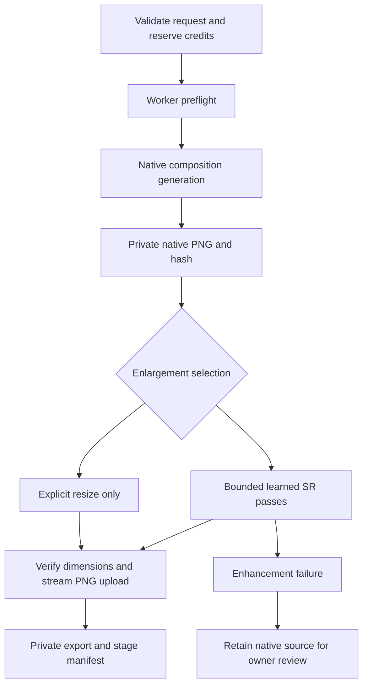

# High-resolution generation, pipeline v2

The application now distinguishes composition generation, learned super-resolution,
and final export. A resolution label does not change the base model's training or
native generation limit. The 8K option uses **8192 pixels on the longest edge**:
8192 × 8192 for square and 8192 × 4608 for 16:9. This is not the television UHD
format of 7680 × 4320. Neither enlarged pixels nor more parameters guarantee
photorealism or correct text, anatomy and fine geometry.

## Processing architecture



1. The server validates model, effort, aspect ratio and adapter before reserving
   credits. Native generation remains within the configured 4 MP / 2048-edge
   capability budget. The original prompt, seed and approved adapter remain the
   composition controls; the SR model is a separate checkpoint.
2. For learned requests the worker checks the device, loads the trusted checkpoint
   on CPU, verifies RGB channels, 2×/4× scale and external tiling support **before**
   submitting the paid generation. A failed preflight refunds credits.
3. The provider produces the composition. Existing provider/local checks run as
   before. The worker saves an immutable job-specific native PNG, SHA-256, byte
   count and dimensions to private storage before enhancement. Provider task IDs
   remain in the owner record when progress updates are written.
4. `sr_plan` computes enough 2× or 4× learned passes to cover both export
   dimensions. It retains the full source detail whenever a complete pass fits
   the resource budget. Before an oversized pass it may crop/downsample to
   `ceil(target / model_scale)`. It never enlarges an input with interpolation.
   The final adjustment can only crop/downsample. This avoids huge intermediate
   canvases while giving every enlargement stage a learned prediction.
5. Each pass processes source tiles with an overlapping context halo. Spandrel
   pads inputs for the checkpoint's size requirements; our compositor discards
   the halo and writes each output core exactly once. Tiles with malformed output
   dimensions or non-finite values fail rather than silently corrupting the PNG.
6. A CUDA out-of-memory error retries **only the SR pass**, halving the tile core
   down to 64 pixels. Context stays intact. There is no automatic resize fallback
   and no paid generation retry. Models that discourage external tiling are
   rejected because local tiles can violate their global-context assumptions.
7. The worker records pass input/output sizes, duration, effective tile size,
   padding, architecture and checkpoint SHA-256. It encodes the export to a
   temporary file and streams the file into storage, avoiding a second complete
   encoded PNG buffer. Temporary files are deleted after upload.
8. Progress exposes stage/pass/tile counts, not provider credentials or polling
   URLs. Downloads of both native and final images require the owning user's
   session and share the download rate limit. If enhancement fails, the job is
   uncertain for owner cost reconciliation; its native source remains accessible.

Example: a 1984 × 1984 native square and a 4× checkpoint produce a 7936 × 7936
first pass. The next pass downsamples that intermediate to 2048 × 2048 and applies
4× learned SR to reach 8192 × 8192. Previously this final gap was interpolated.
A 2× checkpoint similarly receives as many learned passes as required, rather
than stopping at one 2× result. Repeated SR can exaggerate texture; evaluate the
chosen checkpoint on your subject matter before selling it as a quality tier.

## Resource and deployment requirements

Install the existing optional dependencies on the **enhancement worker**:

```bash
pip install -e '.[platform,upscale]'
export IMG_CREATOR_DEVICE=cuda
export IMG_CREATOR_SR_WEIGHTS=/models/trusted-photo-sr.pth
export IMG_CREATOR_TILE_SIZE=256
export IMG_CREATOR_TILE_PAD=64
python -m img_creator.platform.worker --backend bfl
```

Use `--backend local` with the inference dependencies and approved adapter to
combine studio training with the same SR path. SR weights stay on CPU during
native generation and move to the selected device when enhancement starts.
The process handles one job at a time; do not run overlapping jobs on the same
GPU without budgeting both inference models and their activations.

Set `IMG_CREATOR_SR_WEIGHTS` on the web service as a capability flag too; that
path needs to exist on the worker, not the web container. The studio defaults to
learned enlargement when configured, and disables that option otherwise. A
configured path is not a health check: actual readiness is verified by the
worker. Use trusted, appropriately licensed photographic SR weights. This
change does not download, train or certify an SR checkpoint for you.

The target limit is 8192 on the longest edge and each learned canvas is bounded
at 70 million pixels (covering 8192-square plus rounding). Accelerator memory is
bounded by a tile and its halo; host memory still holds source/output canvases.
Provision at least 4 GiB host RAM **in addition to CPU-offloaded model needs**,
then measure peak usage on the actual weights. This is an initial provisioning
recommendation, not a measured hardware minimum. A low-memory Render web service
is not an 8K GPU worker. Place the worker on suitable GPU infrastructure with
access to the same private object storage and database. CPU processing is
supported but has not been benchmarked for practical 8K latency.

No DB migration is required: versioned progress/native references live in the
existing `Job.provider_state` JSON and export manifests in `Job.result`. Old jobs
remain readable and simply lack a native-download link. Back up the database and
both PNG objects. Do not delete native objects during an uncertain-job review.
Product credits are unchanged and are not vendor cost estimates; benchmark
multi-pass worker time before setting subscription margins.

## Validation and quality acceptance

Automated tests cover every product aspect ratio/resolution with both 2× and 4×
plans, actual allocation of an 8192-square result using a fake predictor, spatial
filter equivalence across tile boundaries, bounded CUDA retry behavior, source
preservation after enhancement failure, provider-state retention, artifact
hashes, private access and preflight refunds. A CPU integration test also loads a small, randomly initialized ESRGAN checkpoint
through Spandrel and executes real tensor inference across two passes. Invalid
shape and NaN outputs are rejected. These tests and synthetic predictors establish
pipeline correctness, **not neural reconstruction quality**.

Before production, generate a fixed-seed evaluation set using your actual base
model, trained adapter and SR checkpoint: portraits, foliage, architecture,
fabrics, reflective products, small text and low-light scenes. Review native vs
resize vs learned output at 100% crops, including tile boundaries and corners.
Record prompt fidelity, false texture, ringing, identity drift, geometry, text
legibility, latency and peak host/VRAM use. Compare 2× and 4× checkpoints and
single versus repeated passes. Reject regressions rather than treating pixel
count, sharpness or a fabricated quality score as proof of realism. GPU quality
validation and deployment remain outstanding in this environment.

Reference implementations: [Real-ESRGAN tiled inference](https://github.com/xinntao/Real-ESRGAN/blob/master/realesrgan/utils.py),
[Spandrel image descriptor contract](https://chainner.app/spandrel/spandrel.ImageModelDescriptor.html),
and [Spandrel tiling capabilities](https://chainner.app/spandrel/spandrel.ModelTiling.html).
