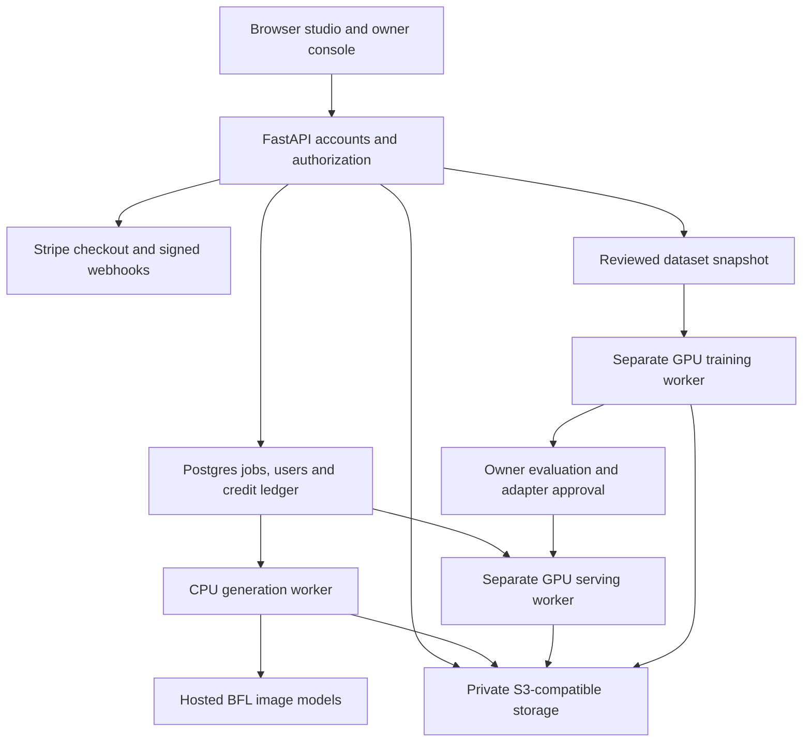

# Hosted studio: architecture, deployment and owner operations

Version 0.4 extends the multi-user application. See [training lifecycle](training-lifecycle.md)
for updated grouped splits, schema revision, checkpoint preservation and API limits. The original local Gradio studio
and single-owner API still work. **Deploy `img_creator.platform.app:app` for the
subscription product; never expose the old local API as the public product.**

## Architecture



The browser never receives provider, database or storage keys. Public registration
creates only user accounts with zero credits. The owner is bootstrapped through a
private CLI. Passwords use scrypt; sessions use hashed random cookie tokens,
HttpOnly/SameSite cookies, CSRF tokens and same-origin checks. Login limits are
stored in the database. Disabled users lose existing sessions. Images are served
only through authenticated, ownership-checked endpoints.

The API commits a job and reserves credits in the same transaction. Per-user
idempotency keys prevent duplicate charges on retried requests. Postgres workers
claim jobs using row locks and leases; they do not hold database locks during model
calls. A lease heartbeat covers loading, inference, upscaling and object uploads.
Known rejections refund credits once. Network uncertainty and interrupted work go
to `uncertain` instead of resubmitting potentially billable provider requests. The
owner checks the provider request and explicitly refunds interrupted work.

Use Postgres for multi-process serving. SQLite is for local development. A single
worker owns each local GPU pipeline. Web replicas do not load model weights. Both
web and workers must share the same private object store: separate Render service
filesystems are not a shared image store.

## Models and resolution

| Model choice | Published parameters | Effort | Backend |
|---|---:|---|---|
| FLUX.2 Klein 4B | 4 billion | Standard, distilled | BFL API |
| FLUX.2 Klein 9B | 9 billion | Standard, distilled | BFL API |
| FLUX.2 Pro | Undisclosed | Standard | BFL API |
| FLUX.2 Flex | Undisclosed | Low / Medium / High (20 / 35 / 50 steps) | BFL API |
| FLUX.2 Max | Undisclosed | Standard | BFL API |
| FLUX.2 Dev 32B | 32 billion | Low / Medium / High | Licensed self-hosted GPU |
| Custom Klein 4B | 4 billion plus LoRA | Low / Medium / High | Owner-approved adapter on GPU |

These controls are image sampling settings, not LLM reasoning modes. Parameter
count is not a quality score. Hosted models are unavailable until the provider key
is configured. Local models require an enabled GPU deployment and moderation key;
Dev also requires the deployment's commercial-license acknowledgement. No provider
filter overrides or fallback bypasses are exposed.

The user selects aspect ratio, style, seed, effort and 1K/2K/4K/8K export. Here K
means a longest edge of 1024/2048/4096/8192 pixels, not television UHD naming.
Generation is conservatively limited to 4,000,000 pixels, a 2048-pixel longest edge,
and multiples of 16. The quote shows exact native and export dimensions before
submission. Larger exports use a disclosed Lanczos resize or configured learned
upscaler. Resizing does not add learned detail; learned SR can distort fine detail.
Missing learned weights produces an explicit error. Configure identical upscaler
settings on web and workers before enabling it.

Generation records include actual seed, effective prompt, model, effort, native
size, export size, provider request, processing method and worker duration. Hosted
model determinism across provider changes is not guaranteed. Do not advertise
“best model”, perfect realism or native 8K without comparative evidence.

## Run locally

```bash
python -m venv .venv
source .venv/bin/activate
pip install -e '.[platform,dev]'
cp .env.platform.example .env.platform
# Edit .env.platform; use test billing keys for development.
set -a
source .env.platform
set +a
python -m img_creator.platform.manage init-db
python -m img_creator.platform.manage create-owner --email owner@example.com
uvicorn img_creator.platform.app:app --host 127.0.0.1 --port 8000 --no-proxy-headers
```

Open http://localhost:8000 using the same hostname as `PUBLIC_URL`. In a second
terminal load the same environment and run:

```bash
python -m img_creator.platform.worker --backend bfl
```

Without a provider key, the UI and admin tools are usable but generation stays
unavailable. No synthetic images are presented as live model results. Use the
owner console to grant a small, auditable test allowance. Password recovery is an
operator CLI (`reset-password --email ...`); automated email verification, password
reset emails and MFA are not implemented in this release.

## Render deployment

`render.yaml` defines a Docker web service, a CPU background worker and Postgres.
Applying it creates paid resources. This repository change does not create cloud
resources or subscribe you to a provider.

1. Create a private S3-compatible bucket (AWS S3 or Cloudflare R2). Use credentials
   scoped to the bucket; deny public access. Enable appropriate lifecycle retention
   and backups. Set `AWS_DEFAULT_REGION` to the actual S3 region, or `auto` for R2.
2. In Render create a shared environment group named `img-creator-secrets` with:
   `PUBLIC_URL` (the exact HTTPS public origin), `BFL_API_KEY`, `S3_BUCKET`,
   `S3_ENDPOINT_URL` (omit for AWS S3), `AWS_ACCESS_KEY_ID`, `AWS_SECRET_ACCESS_KEY`,
   `AWS_DEFAULT_REGION`, and the Stripe keys/price IDs listed below. Start with
   `LOCAL_MODELS_ENABLED=false`. Never copy secrets into render.yaml.
3. Create a Blueprint from this repository and review the services and selected
   plans. It links both services to the same database and secret group. The web
   pre-deploy step creates the initial schema. If the worker starts before the
   first schema creation, restart it after the web service is healthy.
4. Confirm `PUBLIC_URL` matches the generated Render URL or your custom domain;
   keep `COOKIE_SECURE=true`. Sign in and upload a test dataset image to verify
   shared storage. Bootstrap the owner from the web service's private shell.
5. Configure a Stripe test webhook at `https://YOUR_HOST/api/billing/webhook`.
   Complete checkout, generate a test image, check the private gallery, and compare
   provider requests, payments and the credit ledger before switching to live keys.
6. Set alerts for `/health`, process restarts, queue age, `uncertain` jobs and failed
   training. Keep database backups and run a restoration rehearsal. Review costs
   and resource memory at 8K before allowing public traffic.

The bundled container installs CPU platform dependencies only. For learned SR,
use a worker image with the `upscale` extra and mounted trusted weights. For local
inference or training, provision a suitable CUDA host separately with access to the
same Postgres and bucket. The Blueprint blocks external database connections by
default. Add only your GPU host's fixed egress IP if needed, use TLS, and configure
its external database URL. Do not open the database to every IP.

The schema command applies additive revision 2 (new tables only), as detailed in the
training lifecycle guide. It is not a general migration system. For subsequent schema
changes add versioned migrations, back up the database and test upgrades in staging.
The server intentionally does not trust arbitrary forwarded headers; behind a
proxy, anonymous limits can share the proxy's address. Configure trusted proxy
handling with known infrastructure addresses before tuning public rate limits.

## Subscriptions and credit accounting

Create one monthly recurring Stripe Price per plan. Set `STRIPE_SECRET_KEY`,
`STRIPE_WEBHOOK_SECRET`, `STRIPE_STARTER_PRICE_ID` and `STRIPE_PRO_PRICE_ID`.
Starter grants 500 credits and Pro 2000 per paid recurring invoice. These are
editable product allowances, not vendor token counts. Price/currency live in
Stripe and are shown at checkout. There is no invented INR/USD price in the UI.
Enable Stripe's billing portal for cancellation and payment-method updates. Leave
plan switching disabled until you add an explicit proration/credit policy.

Subscribe the webhook to `invoice.paid`, `customer.subscription.created`,
`customer.subscription.updated` and `customer.subscription.deleted`. Configure
monthly billing, no trials and one quantity-one subscription item. Zero-price
coupons would still receive the configured allowance; do not enable them unless
that is your intended promotion policy. Credits roll over and do not expire.
Cancellation stops future replenishment; remaining credits can still be spent.
Proration and one-off invoices do not grant a complete cycle's credits.

Credits are reserved at generation submission. The ledger records every grant,
reservation and refund. Signed webhooks and unique event/invoice keys make payment
replays idempotent. Test concurrent checkout, webhook delivery, delayed events,
payment failure and cancellation in your actual Stripe account. Refunds, disputes,
tax invoices, abuse review, checkout reconciliation and net revenue accounting
still require operational workflows; this release does not automate them.

## Owner console and metrics

The owner can inspect users, enable/disable accounts, issue auditable credit
grants, review recent jobs, reconcile uncertain jobs, and inspect audit events.
Usage totals are aggregated by the database rather than loading every job into
application memory. Each user and model has completed image count, consumed
credits, reported tokens and total worker duration. Account balances show credits
available after reservations. Subscription state and gross paid invoices are shown;
currencies stay separate and amounts remain in their minor units.

`null` token/cost values mean the provider did not report them. These BFL/local
adapters do not currently report token counts or billed GPU seconds. Worker time
includes inference, waiting, export and storage, so it must not be labeled billed
GPU time. Revenue is gross receipts, not profit; it excludes refunds/disputes.
Only successful image jobs contribute to consumed-credit totals; uncertain jobs
retain a reservation pending review.

## Dataset upload, training and promotion

Supported single-file uploads: PNG, JPEG, WebP, BMP, single-frame TIFF; PDF, DOCX,
UTF-8 TXT, Markdown, CSV and JSONL. Each file is limited to 25 MB. Images must be
256 pixels per side or larger and at most 20 MP. Documents have bounded parsing;
PDFs must be unencrypted, have at most 100 pages and contain extractable text.
Scanned PDFs require external OCR. Archives, executable content and unsupported
formats are rejected rather than guessed. “Any format” is not technically valid.

1. Owner creates a dataset with a rights/provenance note.
2. Upload originals. Images are orientation-normalized and metadata is removed;
   exact normalized duplicates are rejected. Document text is retained as reference.
3. Write accurate captions and approve images. Documents do not automatically
   become training examples, and their text is never executed as instructions.
4. Queue a bounded Klein base 4B LoRA run with 5–2000 approved images, learning
   rate, steps and rank. The run freezes image hashes and captions. A deterministic
   grouped split holds out roughly 10% of groups. Set subject/shoot groups on image
   cards; semantic near-duplicate detection is not automated. For bulk data,
   use the existing grouped-split CLI and a separate training integration.
5. On the GPU host install `.[platform,inference,training]`, obtain the pinned
   Diffusers checkout documented in `training/README.md`, and run from this repo:

```bash
python -m img_creator.platform.training_worker \
  --diffusers-checkout /absolute/path/to/diffusers --timeout-hours 12
```

6. Watch TensorBoard scalar history (when emitted), train/validation counts and
   elapsed runtime in the owner console. The worker verifies snapshot hashes and
   saves a safetensors artifact with its SHA-256. A successful training process
   enters `awaiting_evaluation`, never automatic production approval.
7. Compare base and adapter outputs on held-out prompts/seeds. Check anatomy,
   prompt fidelity, texture, text, memorization and failure cases. Record your
   review report and scores. Scores are explicitly **manual**, not measured FID,
   CLIP or aesthetic benchmarks. Validation images are withheld; the pilot does
   not automatically compute validation loss or image-quality metrics.
8. Approve a satisfactory run. Enable `LOCAL_MODELS_ENABLED`, set the moderation
   credential, then run `python -m img_creator.platform.worker --backend local`
   on the serving GPU. Users select the approved run under Custom Klein 4B.
   Withdrawal hides the adapter and prevents queued uses from loading it.

This is adapter fine-tuning, not training a foundation model from scratch. It does
not fine-tune the closed hosted Pro/Flex/Max models. The pilot's upstream trainer
loads tensors eagerly, so 2000 images is a cap, not a memory guarantee. Start with
20–100 curated examples and measure RAM/VRAM. The existing sharded dataset tools
support preparing larger collections; distributed streaming training is still a
separate engineering project. No training or quality results have been fabricated.

## Validation before a paid launch

Run `pip install -e '.[platform,dev,ui]'` then `pytest -q`. Tests use fake provider
outputs and cover authentication, owner authorization, CSRF, tenant isolation,
credit races, idempotency, job leases, refund behavior, invoice replay, datasets,
training gates and usage units. They do not replace live provider/billing tests.

Still required on your chosen infrastructure: actual GPU inference and training,
model/download licenses, visual comparisons, Postgres load/concurrency testing,
S3 permissions and restore tests, Stripe test-mode end-to-end verification, parser
isolation for untrusted document formats, dependency locking, retention/deletion
workflows and a measured margin/capacity budget. Until those pass, treat this as a
staging implementation, not a validated paid production service.

References checked during implementation:
- https://docs.bfl.ai/flux_2/flux2_overview
- https://api.bfl.ai/docs
- https://render.com/docs/blueprint-spec
- https://docs.stripe.com/billing/subscriptions/webhooks
