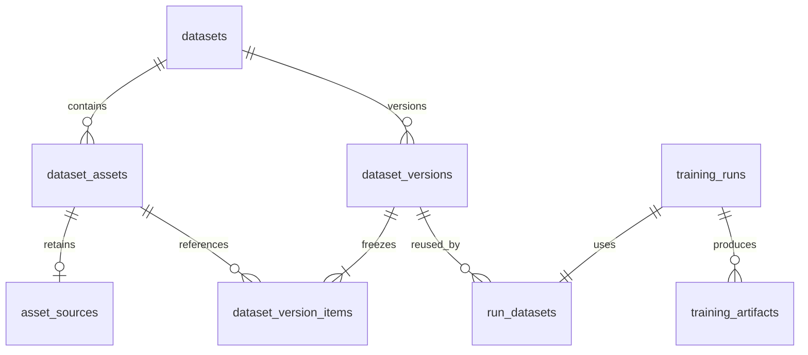

# Training-first workflow and durable data schema — v0.4

This update improves preparation, experimental controls, recovery and serving of
owner-trained **Klein base 4B LoRA adapters**. It does not train or replace a
foundation model, and it does not remove provider or local moderation. GPU image
quality still needs measurement using your actual images and hardware.

## Train first, evaluate, then serve

1. Create a private dataset with a provenance/rights note. Upload clear, varied
   images and write accurate captions describing visible subjects, materials,
   lighting and composition. Text documents remain references, not training pairs.
2. Inspect the new low-resolution and low-edge-variance flags. These are review
   heuristics, not proof that an image is bad. Put related images from the same
   subject or shoot in the same group using the dataset card's group field.
3. Start with a small curated experiment. The pilot remains capped at 2000 images
   because the upstream trainer eagerly decodes its dataset. Begin with 20–100;
   this cap does not guarantee that your GPU or RAM can handle all 2000.
4. In **Model training → Training and validation settings**, choose resolution
   (512/768/1024), learning rate, accumulation, constant/linear/cosine schedule,
   warmup, held-out fraction and validation prompt. Aspect-ratio buckets are enabled
   in the pinned trainer, reducing unnecessary square cropping. Warmup must be
   shorter than the run. Gradient checkpointing and BF16 remain enabled.
5. The server freezes a relational dataset version. Grouped splits keep related
   examples together. A fixed split seed ranks group hashes; approximately the
   selected fraction of groups is held out. Image fractions can differ when groups
   have unequal sizes. Groups with fewer than two independent groups are rejected.
   The split does not automatically discover semantically related photographs.
6. The GPU worker verifies snapshot and image checksums, materializes only training
   images, and runs the pinned Diffusers script. It records loss/LR scalar history
   when the trainer emits it. Validation prompts generate qualitative samples;
   **held-out image loss, FID and automatic aesthetic quality are not computed**.
7. Inspect fixed-seed base/adapter comparisons, held-out compositions, anatomy,
   text and memorization. Record the existing owner evaluation before approval.
   Training loss alone is not a photorealism score.
8. Enable the local GPU serving worker, choose Custom Klein 4B and the approved
   adapter. New **adapter influence** (0–1.5, default 1) lets you compare strengths
   using the same seed. Zero provides a base-model comparison; higher strengths
   can exaggerate textures. Strength is stored in request/output metadata.
9. For high-resolution output, choose 4K/8K **learned** upscaling after configuring
   trusted SR weights on the generation worker. Native diffusion remains bounded
   near the provider's supported resolution. Export size is not equivalent to
   native 8K detail. Compare original, Lanczos and learned results on faces, text,
   fine mechanical parts and tile boundaries before selecting your serving preset.

## Relational schema and preservation



| Table | Purpose and integrity |
|---|---|
| `asset_sources` | One row per newly ingested asset; original private object key, SHA-256, byte count, subject/shoot group and review flags. |
| `dataset_versions` | Dataset ID, content hash, split algorithm/settings and creation time. Dataset+hash is unique; identical experiments reuse the version. |
| `dataset_version_items` | Composite key (version, asset), frozen caption/group/split/object key/hash. Later caption edits cannot change earlier versions. |
| `run_datasets` | One dataset-version reference per new training run. Legacy runs retain their existing JSON snapshots. |
| `training_artifacts` | Run, relative path, content-addressed storage key, SHA-256 and size. Unique run+path avoids duplicate inventory rows. |
| `schema_revisions` | Records additive schema revision 2. Existing users, payments, jobs and datasets remain untouched. |

Foreign keys prevent deletion of referenced lineage. No automatic data deletion
or retention expiry is enabled. That also means storage usage grows: set an
explicit retention policy and backup budget before large experiments. Original
uploads can contain EXIF/GPS or document metadata; keep the source bucket private
and restrict credentials. Normalized training images remain separate. Older
uploads do not magically regain originals: a legacy source record, if created
when grouping an old asset, is marked `legacy_normalized_source`.

The API only creates/reads version records; it offers no endpoint to rewrite a
historical version. Database administrators can still modify rows, so database
permissions/backups remain necessary. Historical ledger and audit behavior is
unchanged. Artifact paths are logical paths, never user-submitted execution paths.

## Upgrade and backup

Back up Postgres and private object storage first. Stop workers during the initial
upgrade, deploy the new web image, and run:

```bash
python -m img_creator.platform.manage init-db
```

The Render pre-deploy command already invokes this. Revision 2 only creates new
tables and records its version; it does not rename/drop/rewrite old tables. A
Postgres advisory transaction lock serializes this initialization. Repeated runs
are safe. This is an additive revision, not a general-purpose migration framework;
future changes to existing columns require explicit migration scripts.

Restart GPU/CPU workers with the same database and bucket settings. Preserve the
Postgres backup and object versions together; restoring metadata alone cannot
recover missing image/checkpoint bytes. Enable bucket versioning and database
backups in your provider console and rehearse restoration.

## Persistent training workspace and recovery

Set `TRAINING_WORK_DIR` to a **mounted persistent GPU volume**, for example
`/srv/img-training`. The default relative directory is convenient locally but is
not durable on an ephemeral container filesystem. Run directories contain the
snapshot, launch/config, materialized training data, logs and trainer outputs.
They are retained after success or failure; cleanup is an explicit operator action.

A background heartbeat covers dataset reads, model startup and artifact upload.
Successful runs stream checkpoint, TensorBoard, validation and final output files
into private object storage. Content hashes index their database records. On a
handled failure, logs, configuration and earlier checkpoints are archived; the
newest checkpoint is excluded because it may be incomplete. A machine crash or
SIGKILL can bypass archival: recover the persistent volume first. This release
archives remotely when a run stops, not continuously during each training step.

Inspect **Stored run files** in the owner console. To restore from object storage:

```bash
python -m img_creator.platform.manage restore-run \
  --run-id YOUR_RUN_ID --output /srv/recovery/new-directory
```

The destination must be new. Every archived file and training image is verified
against its SHA-256. The command rebuilds the captioned dataset and writes
`RESTORE_VERIFIED` only after all checks pass. A failed restore leaves partial files
for inspection without that marker. Use a new directory for another attempt.

To resume, inspect the restored launch settings and a complete checkpoint, use
the same pinned Diffusers revision/model/configuration, then pass the trusted
checkpoint path to `training.train_lora --resume ... --run` with the restored
dataset and a new output directory. This is an operator workflow: there is no
one-click automatic retry, and manual resumed output is not automatically promoted
into the web model registry. Never load optimizer state from untrusted uploads.

## API protection

Authenticated routes now have a shared database-backed limit (default 300/min per
account). Downloads are capped at 60/min; owner uploads at 120/hour; new training
requests at 6/hour with at most three active runs per dataset. Existing login,
registration and generation limits remain. Limits return HTTP 429 and Retry-After.
They are fixed windows, not a distributed edge DDoS shield.

`EXPOSE_API_DOCS=false` disables `/docs` and `/openapi.json` by default. This is
reduced discoverability, not authorization. A browser application's endpoints
cannot be hidden from its users. Session authentication, CSRF, ownership checks,
owner-only training routes, private storage and server-held provider credentials
remain the access controls. Webhooks still require Stripe signature validation.
Restrict database access to service/GPU egress IPs and configure edge protection
and trusted proxies at deployment time.

## Upstream basis and limits

- [Diffusers DreamBooth guidance](https://huggingface.co/docs/diffusers/training/dreambooth): hyperparameter sensitivity, validation and overfitting.
- [Pinned Klein training implementation](https://github.com/huggingface/diffusers/blob/031b2798addadd1652db7cfba50eacc1079245cf/examples/dreambooth/train_dreambooth_lora_flux2_klein.py): aspect-ratio buckets, schedules, validation prompts and checkpoint state.
- [BFL model overview](https://docs.bfl.ai/flux_2/flux2_overview): use undistilled base variants for fine-tuning; model-specific controls and output limits.

These changes provide experimental and recovery infrastructure. Actual GPU
training, overfit checks, checkpoint resume and learned-SR visual acceptance must
still be run with your data. No newly trained weights or quality scores are bundled.
